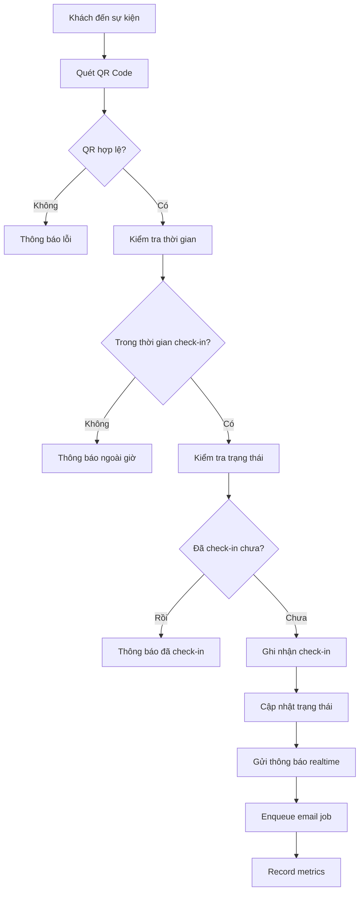
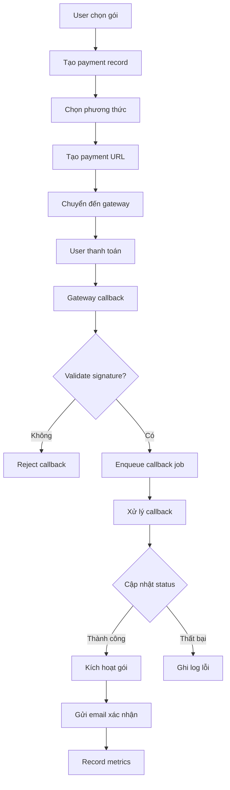
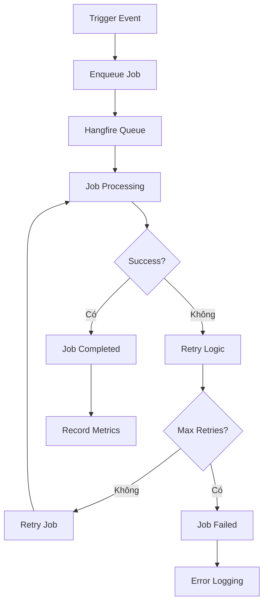
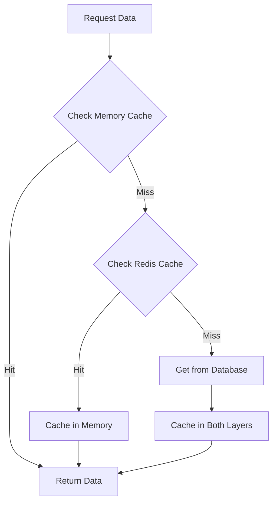

# 🎉 GiaNguyenCheck - Hệ thống quản lý Check-in Sự kiện SaaS đa tenant

## 📋 Mục lục
- [Tổng quan](#tổng-quan)
- [Công nghệ sử dụng](#công-nghệ-sử-dụng)
- [Kiến trúc hệ thống](#kiến-trúc-hệ-thống)
- [Tính năng chính](#tính-năng-chính)
- [Mô hình dữ liệu](#mô-hình-dữ-liệu)
- [Logic nghiệp vụ](#logic-nghiệp-vụ)
- [API Endpoints](#api-endpoints)
- [Giao diện](#giao-diện)
- [Cài đặt & Chạy](#cài-đặt--chạy)
- [Cấu hình](#cấu-hình)
- [Deployment](#deployment)
- [Monitoring & Observability](#monitoring--observability)

---

## 🎯 Tổng quan

**GiaNguyenCheck** là hệ thống SaaS quản lý check-in sự kiện hiện đại, hỗ trợ đa tenant (nhiều tổ chức/công ty), được xây dựng với kiến trúc phân lớp, bảo mật cao và khả năng mở rộng tốt.

### 🎪 Tính năng nổi bật
- ✅ **Đa tenant**: Mỗi tổ chức có dữ liệu riêng biệt, subdomain riêng
- ✅ **Check-in QR Code**: Quét mã QR, nhập thủ công, xác thực bảo mật
- ✅ **Dashboard Realtime**: Thống kê live qua SignalR, biểu đồ động
- ✅ **Tích hợp thanh toán**: MoMo, Stripe, PayPal, VNPAY, chuyển khoản
- ✅ **Phân quyền bảo mật**: 5 cấp độ quyền, JWT, middleware kiểm soát
- ✅ **Email automation**: Gửi mail mời, xác nhận, nhắc nhở tự động
- ✅ **Background Jobs**: Hangfire cho xử lý bất đồng bộ, scheduled jobs
- ✅ **Distributed Caching**: Redis + Memory cache hybrid pattern
- ✅ **Health Checks**: Monitoring toàn diện, payment gateway checks
- ✅ **Metrics Collection**: App.Metrics với Prometheus integration
- ✅ **Webhook Security**: Signature validation cho payment callbacks
- ✅ **Quản lý sự kiện**: CRUD, xuất bản, thống kê, báo cáo
- ✅ **Quản lý khách mời**: Import/Export, gửi mail hàng loạt
- ✅ **Giao diện hiện đại**: Responsive, UX thân thiện, hỗ trợ mobile

---

## 🛠️ Công nghệ sử dụng

### Backend Framework
- **ASP.NET Core 8.0** - Web framework hiện đại, cross-platform
- **Entity Framework Core 8.0** - ORM cho SQL Server
- **SignalR** - Realtime communication cho dashboard
- **Identity Framework** - Authentication & Authorization
- **JWT Bearer Token** - Stateless authentication
- **AutoMapper** - Object mapping
- **FluentValidation** - Data validation

### Background Jobs & Queue
- **Hangfire** - Background job processing, scheduling
- **SQL Server Storage** - Job persistence
- **Recurring Jobs** - Scheduled tasks automation
- **Job Queues** - Priority-based job processing

### Caching & Performance
- **Redis** - Distributed caching, session storage
- **Memory Cache** - In-memory caching
- **Hybrid Cache Pattern** - L1 (Memory) + L2 (Redis)
- **Cache Invalidation** - Smart cache management

### Database & Storage
- **SQL Server 2022** - Primary database
- **Entity Framework Migrations** - Database versioning
- **SQL Server LocalDB** - Development database
- **Database Indexing** - Optimized query performance

### Frontend & UI
- **Razor Views** - Server-side rendering
- **Bootstrap 5** - Responsive UI framework
- **DataTables** - Interactive tables với search, sort, pagination
- **jQuery 3.6** - JavaScript library
- **HTML5 QR Code Scanner** - Quét mã QR bằng camera
- **Chart.js** - Biểu đồ thống kê
- **Font Awesome** - Icons

### Payment Integration
- **MoMo API** - Thanh toán di động Việt Nam
- **Stripe API** - Thanh toán quốc tế
- **PayPal API** - Thanh toán toàn cầu
- **VNPAY API** - Cổng thanh toán Việt Nam
- **Bank Transfer** - Chuyển khoản ngân hàng
- **Webhook Security** - Signature validation

### Email & Communication
- **SMTP Client** - Gửi email
- **HTML Email Templates** - Template email đẹp
- **SignalR Hubs** - Realtime notifications
- **Background Email Processing** - Hangfire jobs

### Security & Authentication
- **ASP.NET Core Identity** - User management
- **JWT Bearer Authentication** - Token-based auth
- **Role-based Authorization** - Phân quyền theo vai trò
- **Tenant Middleware** - Kiểm soát đa tenant
- **CORS Policy** - Cross-origin resource sharing
- **HTTPS/SSL** - Bảo mật kết nối
- **Webhook Signature Validation** - HMAC-SHA256

### Monitoring & Observability
- **App.Metrics** - Metrics collection
- **Prometheus Integration** - Metrics export
- **Health Checks** - Service health monitoring
- **Custom Health Checks** - Payment gateway monitoring
- **Structured Logging** - Serilog integration
- **Performance Metrics** - Response time, throughput

### Development Tools
- **Visual Studio 2022** - IDE chính
- **Git** - Version control
- **NuGet** - Package management
- **Swagger/OpenAPI** - API documentation

### Third-party Libraries
- **QRCoder** - Tạo mã QR
- **System.Drawing** - Xử lý hình ảnh
- **Newtonsoft.Json** - JSON serialization
- **Microsoft.Extensions.Logging** - Logging framework

---

## 🏗️ Kiến trúc hệ thống

### Kiến trúc phân lớp (Layered Architecture)
```
┌─────────────────────────────────────┐
│           Presentation Layer        │
│  Controllers, Views, Middleware     │
├─────────────────────────────────────┤
│           Business Layer            │
│  Services, Interfaces, DTOs         │
├─────────────────────────────────────┤
│           Data Access Layer         │
│  Repositories, DbContext            │
├─────────────────────────────────────┤
│           Data Layer                │
│  Entities, Database, Migrations     │
└─────────────────────────────────────┘
```

### Multi-tenant Architecture
- **Tenant Isolation**: Mỗi tenant có dữ liệu riêng biệt
- **Subdomain Routing**: `tenant1.gianguyencheck.com`
- **Tenant Middleware**: Tự động xác định tenant từ request
- **Shared Database, Separate Schema**: Cùng DB, phân tách theo TenantId

### Background Job Architecture
- **Hangfire Server**: Background job processing
- **Job Queues**: Priority-based processing (default, emails, payments, reports)
- **Recurring Jobs**: Scheduled tasks automation
- **Job Persistence**: SQL Server storage
- **Retry Logic**: Automatic retry with exponential backoff

### Caching Architecture
- **Hybrid Cache Pattern**: Memory (L1) + Redis (L2)
- **Cache Invalidation**: Smart cache management
- **Distributed Cache**: Multi-instance support
- **Cache Patterns**: GetOrSet, RemoveByPattern

### Security Architecture
- **JWT Authentication**: Stateless, scalable
- **Role-based Authorization**: 5 cấp độ quyền
- **Tenant Isolation**: Middleware kiểm soát truy cập
- **API Protection**: CORS, rate limiting, validation
- **Webhook Security**: HMAC-SHA256 signature validation

---

## ⚡ Tính năng chính

### 1. 🔐 Quản lý Tenant & Phân quyền

#### Logic nghiệp vụ:
- **Tenant Creation**: Chỉ SystemAdmin có thể tạo tenant mới
- **Plan Management**: Gói Free chỉ được cấp bởi admin, không tự đăng ký
- **Subdomain Routing**: Mỗi tenant có subdomain riêng
- **Data Isolation**: Middleware tự động filter dữ liệu theo TenantId

#### Các vai trò:
- **SystemAdmin (0)**: Quản trị toàn hệ thống
- **TenantAdmin (1)**: Chủ tổ chức, quản lý tenant
- **EventManager (2)**: Quản lý sự kiện, khách mời
- **Staff (3)**: Nhân viên check-in, xem báo cáo
- **Viewer (4)**: Chỉ xem báo cáo, không chỉnh sửa

### 2. 📅 Quản lý Sự kiện

#### Logic nghiệp vụ:
- **Event Lifecycle**: Draft → Published → Ongoing → Completed/Cancelled
- **Time Management**: StartTime, EndTime, CheckInStartTime, CheckInEndTime
- **Capacity Control**: MaxGuests, kiểm tra số lượng khách
- **Public/Private**: IsPublic, AllowMultipleCheckIn
- **Image Management**: Upload, resize, optimize banner/logo

#### Các trạng thái sự kiện:
- **Draft (0)**: Bản nháp, chỉ creator mới thấy
- **Published (1)**: Đã xuất bản, khách có thể đăng ký
- **Ongoing (2)**: Đang diễn ra, cho phép check-in
- **Completed (3)**: Đã kết thúc
- **Cancelled (4)**: Đã hủy

### 3. 👥 Quản lý Khách mời

#### Logic nghiệp vụ:
- **Guest Types**: Regular, VIP, Special, Media, Sponsor
- **QR Code Generation**: Tự động tạo mã QR cho mỗi khách
- **Invitation Management**: Gửi mail mời, nhắc nhở, xác nhận
- **Bulk Operations**: Import/Export Excel, gửi mail hàng loạt
- **Status Tracking**: NotSent → Sending → Sent → Viewed

#### Các loại khách:
- **Regular (0)**: Khách thường
- **VIP (1)**: Khách VIP, ưu tiên check-in
- **Special (2)**: Khách đặc biệt
- **Media (3)**: Báo chí, truyền thông
- **Sponsor (4)**: Nhà tài trợ

### 4. 📱 Check-in QR Code

#### Logic nghiệp vụ:
- **QR Generation**: Tạo mã QR với thông tin khách, sự kiện, tenant
- **Encryption**: Mã hóa dữ liệu QR để bảo mật
- **Validation**: Xác thực QR code, kiểm tra thời gian, trạng thái
- **Check-in Process**: Ghi nhận thời gian, device, location
- **Offline Support**: Check-in offline, đồng bộ khi có mạng

#### Các loại check-in:
- **QRCode (0)**: Quét mã QR
- **Manual (1)**: Nhập thủ công
- **Automatic (2)**: NFC, RFID
- **Bulk (3)**: Check-in hàng loạt

#### Trạng thái check-in:
- **CheckedIn (0)**: Đã check-in
- **CheckedOut (1)**: Đã check-out
- **Cancelled (2)**: Đã hủy
- **Pending (3)**: Đang chờ xử lý

### 5. 📊 Dashboard Realtime

#### Logic nghiệp vụ:
- **Real-time Stats**: SignalR push dữ liệu thống kê live
- **Performance Metrics**: Response time, error rate, CPU, memory
- **Analytics**: Trend analysis, prediction
- **Export Reports**: PDF, Excel, CSV

#### Các thống kê chính:
- Tổng số sự kiện, khách mời, check-in
- Doanh thu, thanh toán thành công/thất bại
- Sự kiện đang diễn ra, check-in hôm nay
- Top sự kiện, khách VIP, nhân viên tích cực

### 6. 💳 Tích hợp Thanh toán

#### Logic nghiệp vụ:
- **Payment Gateway Integration**: MoMo, Stripe, PayPal, VNPAY
- **Payment Flow**: Create → Process → Complete/Fail
- **Callback Handling**: Xử lý callback từ gateway với signature validation
- **Refund Management**: Hoàn tiền, partial refund
- **Invoice Generation**: Tạo hóa đơn tự động

#### Các phương thức thanh toán:
- **MoMo (0)**: Thanh toán di động Việt Nam
- **Stripe (1)**: Thanh toán quốc tế
- **PayPal (2)**: Thanh toán toàn cầu
- **VNPAY (3)**: Cổng thanh toán Việt Nam
- **BankTransfer (4)**: Chuyển khoản ngân hàng
- **Cash (5)**: Tiền mặt
- **Free (6)**: Miễn phí

#### Trạng thái thanh toán:
- **Pending (0)**: Đang chờ thanh toán
- **Processing (1)**: Đang xử lý
- **Completed (2)**: Thành công
- **Failed (3)**: Thất bại
- **Cancelled (4)**: Đã hủy
- **Refunded (5)**: Đã hoàn tiền
- **Expired (6)**: Hết hạn

### 7. 📧 Email Automation

#### Logic nghiệp vụ:
- **Template System**: HTML templates với placeholder
- **Background Processing**: Hangfire jobs cho email processing
- **Scheduling**: Gửi mail theo lịch trình
- **Bulk Sending**: Gửi hàng loạt với rate limiting
- **Tracking**: Theo dõi trạng thái gửi, bounce, open rate

#### Các loại email:
- **Invitation Email**: Mời tham gia sự kiện
- **Welcome Email**: Chào mừng user mới
- **Password Reset**: Đặt lại mật khẩu
- **Event Reminder**: Nhắc nhở sự kiện
- **Payment Confirmation**: Xác nhận thanh toán
- **Check-in Notification**: Thông báo check-in

### 8. 🔄 Background Jobs

#### Logic nghiệp vụ:
- **Hangfire Integration**: Professional job queue system
- **Job Types**: Email processing, payment callbacks, report generation
- **Scheduling**: Recurring jobs, delayed jobs
- **Retry Logic**: Automatic retry with exponential backoff
- **Job Monitoring**: Hangfire dashboard

#### Các loại jobs:
- **Email Jobs**: SendInvitationEmail, SendEventReminder, SendBulkEmails
- **Payment Jobs**: ProcessPaymentCallback, SendPaymentReminder
- **Report Jobs**: GenerateEventReport, AggregateDailyMetrics
- **Maintenance Jobs**: CleanupExpiredData, SyncTenantData

### 9. 🚀 Performance & Caching

#### Logic nghiệp vụ:
- **Hybrid Cache Pattern**: Memory (L1) + Redis (L2)
- **Cache Strategies**: GetOrSet, RemoveByPattern, Cache Invalidation
- **Database Optimization**: Indexing, query optimization
- **Rate Limiting**: API protection, resource management

#### Cache Layers:
- **L1 Cache (Memory)**: Fast access, short expiry
- **L2 Cache (Redis)**: Distributed, longer expiry
- **Cache Invalidation**: Smart cache management
- **Cache Patterns**: GetOrSet, RemoveByPattern

### 10. 📈 Monitoring & Observability

#### Logic nghiệp vụ:
- **Metrics Collection**: App.Metrics với Prometheus integration
- **Health Checks**: Service health monitoring
- **Custom Health Checks**: Payment gateway monitoring
- **Performance Tracking**: Response time, throughput, error rates

#### Monitoring Features:
- **Application Metrics**: Check-ins, payments, events, guests
- **Performance Metrics**: API response time, database query time
- **Business Metrics**: Revenue, conversion rates, user engagement
- **Infrastructure Metrics**: CPU, memory, disk usage

---

## 🗄️ Mô hình dữ liệu

### Core Entities

#### Tenant (Tổ chức)
```csharp
public class Tenant : BaseEntity
{
    public string Name { get; set; }
    public string Email { get; set; }
    public string Subdomain { get; set; }
    public ServicePlan CurrentPlan { get; set; }
    public DateTime? PlanExpiryDate { get; set; }
    public bool IsActive { get; set; }
    public string? CustomSettings { get; set; }
    
    // Navigation
    public ICollection<User> Users { get; set; }
    public ICollection<Event> Events { get; set; }
    public ICollection<Payment> Payments { get; set; }
}
```

#### User (Người dùng)
```csharp
public class User : IdentityUser<int>
{
    public string FirstName { get; set; }
    public string LastName { get; set; }
    public int TenantId { get; set; }
    public UserRole Role { get; set; }
    public bool IsActive { get; set; }
    public DateTime? LastLoginAt { get; set; }
    
    // Navigation
    public Tenant Tenant { get; set; }
    public string FullName => $"{FirstName} {LastName}";
}
```

#### Event (Sự kiện)
```csharp
public class Event : TenantEntity
{
    public string Name { get; set; }
    public string? Description { get; set; }
    public string Location { get; set; }
    public DateTime StartTime { get; set; }
    public DateTime EndTime { get; set; }
    public DateTime CheckInStartTime { get; set; }
    public DateTime CheckInEndTime { get; set; }
    public EventStatus Status { get; set; }
    public int? MaxGuests { get; set; }
    public bool IsPublic { get; set; }
    public bool AllowMultipleCheckIn { get; set; }
    public int CreatedByUserId { get; set; }
    
    // Navigation
    public Tenant Tenant { get; set; }
    public User CreatedByUser { get; set; }
    public ICollection<Guest> Guests { get; set; }
    public ICollection<CheckIn> CheckIns { get; set; }
}
```

#### Guest (Khách mời)
```csharp
public class Guest : TenantEntity
{
    public int EventId { get; set; }
    public string FirstName { get; set; }
    public string LastName { get; set; }
    public string Email { get; set; }
    public string? Phone { get; set; }
    public string? Company { get; set; }
    public string? Position { get; set; }
    public GuestType Type { get; set; }
    public bool IsVIP { get; set; }
    public string QRCode { get; set; }
    public string QRCodeHash { get; set; }
    public InvitationStatus InvitationStatus { get; set; }
    public bool IsConfirmed { get; set; }
    
    // Navigation
    public Event Event { get; set; }
    public ICollection<CheckIn> CheckIns { get; set; }
    public string FullName => $"{FirstName} {LastName}";
    public bool IsCheckedIn => CheckIns.Any(c => c.Status == CheckInStatus.CheckedIn);
}
```

#### CheckIn (Lịch sử check-in)
```csharp
public class CheckIn : TenantEntity
{
    public int EventId { get; set; }
    public int GuestId { get; set; }
    public int? CheckedInByUserId { get; set; }
    public DateTime? CheckInTime { get; set; }
    public DateTime? CheckOutTime { get; set; }
    public int? CheckedOutByUserId { get; set; }
    public string? DeviceId { get; set; }
    public string? DeviceInfo { get; set; }
    public string? IpAddress { get; set; }
    public string? Location { get; set; }
    public CheckInStatus Status { get; set; }
    public CheckInType Type { get; set; }
    public bool IsSynced { get; set; }
    
    // Navigation
    public Event Event { get; set; }
    public Guest Guest { get; set; }
    public User? CheckedInByUser { get; set; }
    public User? CheckedOutByUser { get; set; }
    public TimeSpan? Duration => CheckOutTime - CheckInTime;
}
```

#### Payment (Thanh toán)
```csharp
public class Payment : BaseEntity
{
    public int TenantId { get; set; }
    public ServicePlan Plan { get; set; }
    public string PlanName { get; set; }
    public int DurationMonths { get; set; }
    public decimal Amount { get; set; }
    public string Currency { get; set; }
    public PaymentMethod Method { get; set; }
    public PaymentStatus Status { get; set; }
    public string? TransactionId { get; set; }
    public string ReferenceCode { get; set; }
    public DateTime? PaidAt { get; set; }
    public DateTime ValidFrom { get; set; }
    public DateTime ValidTo { get; set; }
    public bool AutoRenew { get; set; }
    
    // Navigation
    public Tenant Tenant { get; set; }
    public User? User { get; set; }
}
```

#### AuditLog (Lịch sử thay đổi)
```csharp
public class AuditLog : BaseEntity
{
    public int TenantId { get; set; }
    public int? UserId { get; set; }
    public string EntityType { get; set; }
    public int EntityId { get; set; }
    public string Action { get; set; }
    public string? OldValues { get; set; }
    public string? NewValues { get; set; }
    public string? Description { get; set; }
    public string? IpAddress { get; set; }
    public string? UserAgent { get; set; }
    public DateTime Timestamp { get; set; }
    
    // Navigation
    public Tenant Tenant { get; set; }
    public User? User { get; set; }
}
```

---

## 🔄 Logic nghiệp vụ chi tiết

### 1. Quy trình Check-in



### 2. Quy trình Thanh toán



### 3. Quy trình Background Jobs



### 4. Quy trình Caching



---

## 🌐 API Endpoints

### Authentication
```
POST /api/auth/login
POST /api/auth/register
POST /api/auth/refresh-token
POST /api/auth/logout
POST /api/auth/forgot-password
POST /api/auth/reset-password
```

### Events
```
GET    /api/events
POST   /api/events
GET    /api/events/{id}
PUT    /api/events/{id}
DELETE /api/events/{id}
POST   /api/events/{id}/publish
POST   /api/events/{id}/unpublish
GET    /api/events/{id}/stats
```

### Guests
```
GET    /api/guests
POST   /api/guests
GET    /api/guests/{id}
PUT    /api/guests/{id}
DELETE /api/guests/{id}
POST   /api/guests/import
GET    /api/guests/export
POST   /api/guests/{id}/send-invitation
```

### Check-in
```
POST   /api/checkin/scan
POST   /api/checkin/manual
GET    /api/checkin/event/{eventId}
POST   /api/checkin/guest/{guestId}/checkin
POST   /api/checkin/guest/{guestId}/checkout
GET    /api/checkin/stats
GET    /api/checkin/export
```

### Payments
```
GET    /api/payments
POST   /api/payments
GET    /api/payments/{id}
POST   /api/payments/{id}/refund
GET    /api/payments/stats
POST   /api/payments/callback/{method}
```

### Dashboard
```
GET    /api/dashboard/stats
GET    /api/dashboard/events-stats
GET    /api/dashboard/checkin-stats
GET    /api/dashboard/revenue-stats
GET    /api/dashboard/realtime-data
GET    /api/dashboard/analytics
```

### System Admin
```
GET    /api/admin/tenants
POST   /api/admin/tenants
PUT    /api/admin/tenants/{id}
DELETE /api/admin/tenants/{id}
POST   /api/admin/tenants/{id}/invite
GET    /api/admin/users
POST   /api/admin/users
```

### Monitoring & Health
```
GET    /health
GET    /health/ready
GET    /health/live
GET    /metrics
GET    /metrics-text
```

---

## 🎨 Giao diện

### Layout chính
- **Responsive Design**: Bootstrap 5, mobile-first
- **Navigation**: Sidebar với menu theo vai trò
- **Header**: Logo, user info, notifications
- **Footer**: Copyright, links

### Các trang chính

#### Dashboard
- **Thống kê tổng quan**: Cards với số liệu chính
- **Biểu đồ**: Chart.js cho trend analysis
- **Realtime updates**: SignalR push notifications
- **Quick actions**: Nút tạo sự kiện, check-in nhanh

#### Events Management
- **Danh sách sự kiện**: DataTable với filter, search, pagination
- **Tạo sự kiện**: Form validation, image upload, preview
- **Chi tiết sự kiện**: Thông tin, khách mời, check-in stats
- **Export/Import**: Excel, PDF, CSV

#### Check-in Interface
- **QR Scanner**: HTML5 camera API
- **Manual Input**: Form nhập thủ công
- **Check-in List**: Real-time updates
- **Statistics**: Progress bars, charts

#### Guest Management
- **Guest List**: Advanced filtering, bulk operations
- **Import/Export**: Excel templates
- **Email Campaigns**: Template editor, scheduling
- **QR Code Management**: Generate, print, email

#### Payment Management
- **Payment History**: Transaction logs
- **Payment Methods**: Gateway configuration
- **Invoices**: PDF generation
- **Refunds**: Process management

#### Hangfire Dashboard
- **Job Monitoring**: Real-time job status
- **Recurring Jobs**: Scheduled tasks management
- **Job History**: Success/failure tracking
- **Performance Metrics**: Job processing stats

---

## 🚀 Cài đặt & Chạy

### Yêu cầu hệ thống
- **.NET 8.0 SDK** hoặc cao hơn
- **SQL Server 2019** hoặc cao hơn (hoặc LocalDB)
- **Redis Server** 6.0 hoặc cao hơn
- **Visual Studio 2022** (khuyến nghị)
- **Git** cho version control

### Bước 1: Clone repository
```bash
git clone https://github.com/your-username/GiaNguyenCheck.git
cd GiaNguyenCheck
```

### Bước 2: Cài đặt Redis
```bash
# Windows (Docker)
docker run -d -p 6379:6379 redis:alpine

# Linux
sudo apt-get install redis-server

# macOS
brew install redis
```

### Bước 3: Cấu hình database
1. Mở `appsettings.json`
2. Cập nhật connection strings:
```json
{
  "ConnectionStrings": {
    "DefaultConnection": "Server=(localdb)\\mssqllocaldb;Database=GiaNguyenCheckDb;Trusted_Connection=true;MultipleActiveResultSets=true",
    "Redis": "localhost:6379"
  }
}
```

### Bước 4: Restore packages
```bash
dotnet restore
```

### Bước 5: Tạo database
```bash
dotnet ef database update
```

### Bước 6: Chạy ứng dụng
```bash
dotnet run
```

### Bước 7: Truy cập
- **Web Application**: http://localhost:5000
- **API Documentation**: http://localhost:5000/swagger
- **Hangfire Dashboard**: http://localhost:5000/hangfire
- **Health Checks**: http://localhost:5000/health
- **Metrics**: http://localhost:5000/metrics

---

## ⚙️ Cấu hình

### Email Settings
```json
{
  "EmailSettings": {
    "Host": "smtp.gmail.com",
    "Port": 587,
    "EnableSsl": true,
    "Username": "your-email@gmail.com",
    "Password": "your-app-password",
    "FromEmail": "noreply@gianguyencheck.com",
    "FromName": "GiaNguyenCheck"
  }
}
```

### JWT Settings
```json
{
  "Jwt": {
    "Key": "your-super-secret-key-here-minimum-16-characters",
    "Issuer": "GiaNguyenCheck",
    "Audience": "GiaNguyenCheckUsers",
    "ExpiryInHours": 24
  }
}
```

### Payment Gateway Settings
```json
{
  "PaymentSettings": {
    "MoMo": {
      "PartnerCode": "your-partner-code",
      "AccessKey": "your-access-key",
      "SecretKey": "your-secret-key",
      "Endpoint": "https://test-payment.momo.vn/v2/gateway/api/create",
      "WebhookSecret": "your-webhook-secret"
    },
    "Stripe": {
      "PublishableKey": "pk_test_your-key",
      "SecretKey": "sk_test_your-key",
      "WebhookSecret": "whsec_your-webhook-secret"
    },
    "VNPAY": {
      "TmnCode": "your-tmn-code",
      "HashSecret": "your-hash-secret",
      "Url": "https://sandbox.vnpayment.vn/paymentv2/vpcpay.html",
      "WebhookSecret": "your-webhook-secret"
    },
    "PayPal": {
      "ClientId": "your-client-id",
      "ClientSecret": "your-client-secret",
      "WebhookSecret": "your-webhook-secret"
    }
  }
}
```

### Cache Settings
```json
{
  "Cache": {
    "MemoryCacheExpiryMinutes": 5,
    "RedisCacheExpiryMinutes": 30,
    "EnableHybridCache": true
  }
}
```

### Hangfire Settings
```json
{
  "Hangfire": {
    "WorkerCount": 10,
    "RetryAttempts": 3,
    "RetryDelayMinutes": 5
  }
}
```

### Metrics Settings
```json
{
  "Metrics": {
    "Enabled": true,
    "PrometheusEndpoint": "/metrics",
    "MetricsEndpoint": "/metrics-text"
  }
}
```

---

## 📊 Monitoring & Observability

### Health Checks
- **Database Health**: Connection, query performance
- **Redis Health**: Connection, memory usage
- **Payment Gateway Health**: API availability, response time
- **External Services**: MoMo, VNPAY, Stripe, PayPal

### Metrics Collection
- **Application Metrics**: Check-ins, payments, events, guests
- **Performance Metrics**: API response time, database query time
- **Business Metrics**: Revenue, conversion rates, user engagement
- **Infrastructure Metrics**: CPU, memory, disk usage

### Logging
- **Structured Logging**: JSON format, correlation IDs
- **Log Levels**: Debug, Information, Warning, Error, Critical
- **Log Aggregation**: Centralized logging system
- **Log Retention**: Configurable retention policies

### Alerting
- **Health Check Failures**: Immediate alerts
- **Performance Degradation**: Threshold-based alerts
- **Error Rate Spikes**: Automatic alerting
- **Business Metrics**: Revenue, user activity alerts

---

## 🚀 Deployment

### Development
```bash
dotnet run --environment Development
```

### Production
```bash
dotnet publish -c Release -o ./publish
dotnet ./publish/GiaNguyenCheck.dll --environment Production
```

### Docker (Tùy chọn)
```dockerfile
FROM mcr.microsoft.com/dotnet/aspnet:8.0 AS base
WORKDIR /app
EXPOSE 80
EXPOSE 443

FROM mcr.microsoft.com/dotnet/sdk:8.0 AS build
WORKDIR /src
COPY ["GiaNguyenCheck.csproj", "./"]
RUN dotnet restore "GiaNguyenCheck.csproj"
COPY . .
RUN dotnet build "GiaNguyenCheck.csproj" -c Release -o /app/build

FROM build AS publish
RUN dotnet publish "GiaNguyenCheck.csproj" -c Release -o /app/publish

FROM base AS final
WORKDIR /app
COPY --from=publish /app/publish .
ENTRYPOINT ["dotnet", "GiaNguyenCheck.dll"]
```

### Docker Compose
```yaml
version: '3.8'
services:
  web:
    build: .
    ports:
      - "5000:80"
    depends_on:
      - sqlserver
      - redis
    environment:
      - ASPNETCORE_ENVIRONMENT=Production
      - ConnectionStrings__DefaultConnection=Server=sqlserver;Database=GiaNguyenCheckDb;User Id=sa;Password=YourPassword123!;TrustServerCertificate=true
      - ConnectionStrings__Redis=redis:6379
  
  sqlserver:
    image: mcr.microsoft.com/mssql/server:2022-latest
    environment:
      - ACCEPT_EULA=Y
      - SA_PASSWORD=YourPassword123!
    ports:
      - "1433:1433"
    volumes:
      - sqlserver_data:/var/opt/mssql
  
  redis:
    image: redis:alpine
    ports:
      - "6379:6379"
    volumes:
      - redis_data:/data

volumes:
  sqlserver_data:
  redis_data:
```

### Azure Deployment
1. Tạo Azure App Service
2. Cấu hình connection strings
3. Deploy từ Visual Studio hoặc Azure CLI
4. Cấu hình custom domain cho multi-tenant
5. Setup Redis Cache service
6. Configure monitoring và alerting

---

## 📈 Performance & Optimization

### Database Optimization
- **Indexing**: Composite indexes cho queries phổ biến
- **Query Optimization**: EF Core query optimization
- **Connection Pooling**: Optimized connection management
- **Caching**: Query result caching

### Caching Strategy
- **Hybrid Cache**: Memory + Redis pattern
- **Cache Invalidation**: Smart cache management
- **Cache Warming**: Pre-load frequently accessed data
- **Cache Monitoring**: Hit/miss ratio tracking

### Background Job Optimization
- **Job Queues**: Priority-based processing
- **Retry Logic**: Exponential backoff
- **Job Monitoring**: Real-time job status
- **Resource Management**: Worker count optimization

### API Performance
- **Rate Limiting**: API protection
- **Response Compression**: Gzip compression
- **Async/Await**: Non-blocking operations
- **Pagination**: Efficient data loading

---

## 🔒 Security

### Authentication & Authorization
- **JWT Tokens**: Stateless authentication
- **Role-based Access**: 5 cấp độ quyền
- **Tenant Isolation**: Middleware kiểm soát
- **API Protection**: Rate limiting, CORS

### Data Protection
- **Encryption**: QR code data encryption
- **Hashing**: Password hashing với Identity
- **HTTPS**: SSL/TLS encryption
- **Input Validation**: FluentValidation

### Webhook Security
- **Signature Validation**: HMAC-SHA256
- **Timestamp Validation**: Replay attack prevention
- **IP Whitelisting**: Gateway IP validation
- **Rate Limiting**: Webhook rate limiting

---

## 🤝 Đóng góp

### Cách đóng góp
1. Fork repository
2. Tạo feature branch
3. Commit changes
4. Push to branch
5. Tạo Pull Request

### Coding Standards
- **C#**: Microsoft coding conventions
- **JavaScript**: ESLint, Prettier
- **CSS**: Bootstrap conventions
- **Comments**: XML documentation

---

## 📞 Liên hệ & Hỗ trợ

- **Email**: support@gianguyencheck.com
- **Website**: https://gianguyencheck.com
- **Documentation**: https://docs.gianguyencheck.com
- **Issues**: https://github.com/your-username/GiaNguyenCheck/issues

---

## 📄 License

MIT License - Xem file [LICENSE](LICENSE) để biết thêm chi tiết.

---

**GiaNguyenCheck Team** © 2024 - Hệ thống quản lý check-in sự kiện hiện đại, bảo mật và dễ sử dụng! 🎉

## 🚀 Roadmap

### Phase 1: Performance & Scalability ✅
- ✅ Caching system với Memory Cache
- ✅ Background jobs cho heavy processing
- ✅ Database optimization với composite indexes
- ✅ Rate limiting cho API protection
- ✅ Audit trail với event sourcing

### Phase 2: Testing & Quality Assurance
- Unit tests cho tất cả services
- Integration tests cho API endpoints
- Performance testing với load testing
- Security testing với penetration testing

### Phase 3: Advanced Features
- CQRS pattern cho scalability
- Event sourcing cho audit trail
- Microservices architecture
- Real-time analytics với AI

### Phase 4: Mobile Application
- React Native app cho iOS/Android
- Offline check-in capability
- Push notifications
- Native QR code scanning

### Phase 5: AI & Machine Learning
- Attendance prediction
- Fraud detection
- Smart recommendations
- Automated reporting 